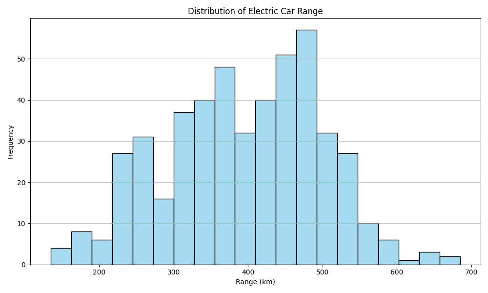
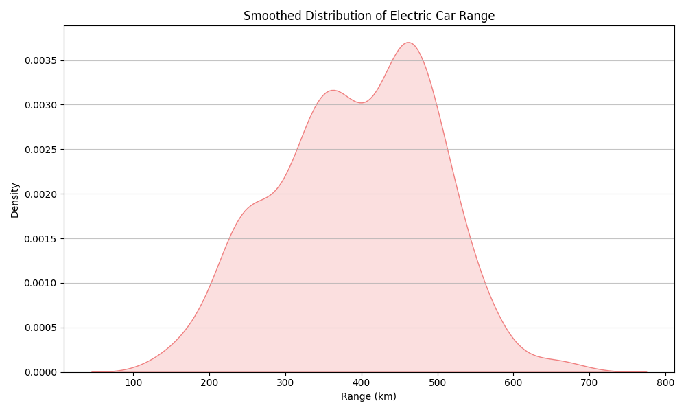
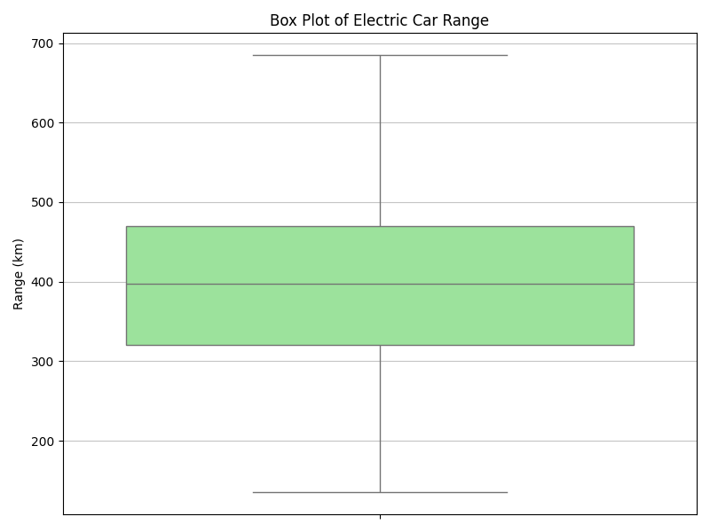

# Distribution of Electric Car Range

This report details the distribution of the estimated electric range (in kilometers) for electric vehicles, based on the provided cleaned dataset. Understanding this distribution is crucial for assessing typical vehicle capabilities and identifying market trends.

## 1. Dataset Overview

The analysis is performed on a cleaned dataset of electric vehicle specifications, containing 478 entries and 21 columns. The `range_km` column, which is the focus of this analysis, is of integer type and has no missing values, as confirmed by the profiling report.

## 2. Descriptive Statistics for 'range_km'

The following table presents the key descriptive statistics for the `range_km` column, providing a quantitative summary of the data's central tendency, dispersion, and range.

| Statistic   |   Value |
|:------------|--------:|
| count       |  478    |
| mean        |  393.18 |
| std         |  103.29 |
| min         |  135    |
| 25%         |  320    |
| 50%         |  397.5  |
| 75%         |  470    |
| max         |  685    |

From these statistics, we observe that the average electric car in the dataset has an estimated range of approximately 393.18 km. The standard deviation of 103.29 km indicates a moderate spread in range values. The minimum range is 135 km, while the maximum is 685 km, showing a wide variability in vehicle capabilities.

## 3. Visualizing the Distribution of 'range_km'

To further understand the distribution, we present a histogram, a Kernel Density Estimate (KDE) plot, and a box plot.

### 3.1. Histogram of Electric Car Range

The histogram below illustrates the frequency distribution of electric car ranges.

The histogram shows that the ranges are concentrated between approximately 300 km and 500 km, with a noticeable peak around the 350-450 km mark. The distribution appears to be unimodal and slightly skewed to the right, indicating that there are more vehicles with ranges slightly above the average than significantly below.

### 3.2. Kernel Density Estimate (KDE) Plot of Electric Car Range

The KDE plot provides a smoothed representation of the probability density function of the 'range_km' values.

The KDE plot reinforces the observations from the histogram, showing a clear unimodal distribution with its highest density around 400 km. The curve gently tapers off on both sides, with a longer tail towards higher ranges, confirming the slight positive skewness.

### 3.3. Box Plot of Electric Car Range

The box plot summarizes the five-number summary (minimum, first quartile, median, third quartile, and maximum) and highlights potential outliers.

The box plot visually confirms the central tendency and spread. The median (397.5 km) is close to the center of the box, suggesting a relatively symmetrical distribution within the interquartile range (IQR = 470 - 320 = 150 km). The whiskers extend to cover most of the data, but there are several individual points above the upper whisker, indicating the presence of electric vehicles with exceptionally long ranges, which are considered outliers in this dataset.

## 4. Comprehensive Summary of 'range_km' Distribution

The distribution of electric car ranges in the dataset is generally unimodal and slightly positively skewed. The majority of electric vehicles offer a range between 300 km and 500 km, with the most common range falling around 400 km.

-   **Central Tendency:** The mean range is 393.18 km, and the median is 397.5 km. The proximity of the mean and median suggests that while there's a slight skew, the central point of the data is well-represented by both measures.
-   **Variability:** The standard deviation of 103.29 km indicates a moderate dispersion of range values around the mean. The interquartile range (IQR) of 150 km (from 320 km to 470 km) encompasses the middle 50% of the vehicles, showing a significant spread within typical ranges.
-   **Shape:** Both the histogram and KDE plot reveal a unimodal distribution, meaning there's one primary cluster of range values. The slight positive skewness suggests that while most cars have ranges clustered around the average, there are fewer cars with very high ranges, pulling the mean slightly above the median.
-   **Notable Observations:** The box plot clearly identifies several outliers on the higher end of the range spectrum. These vehicles represent models capable of significantly longer distances on a single charge compared to the bulk of the market. The minimum range observed is 135 km, indicating some models are designed for shorter urban commutes.

In conclusion, the dataset reveals a diverse range of electric vehicle capabilities, with a strong concentration of models offering practical ranges for everyday use, alongside a segment of high-range vehicles.